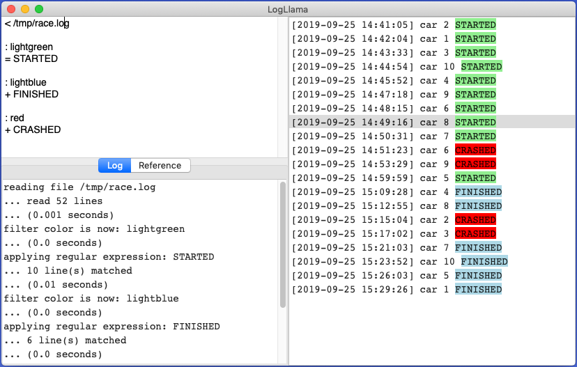

# Getting Started

TODO -- THIS PAGE IS STILL UNDER CONSTRUCTION

## Example

Here is a sample script.  It reads the log of an automobile race and performs some filtering and hilighting.

```
< /tmp/race.txt

: yellow
~ LAP=2

: lightgreen
= STARTED

: lightblue
+ FINISHED

: red
+ CRASHED
```

Here is what the screen looks like after running this script:




