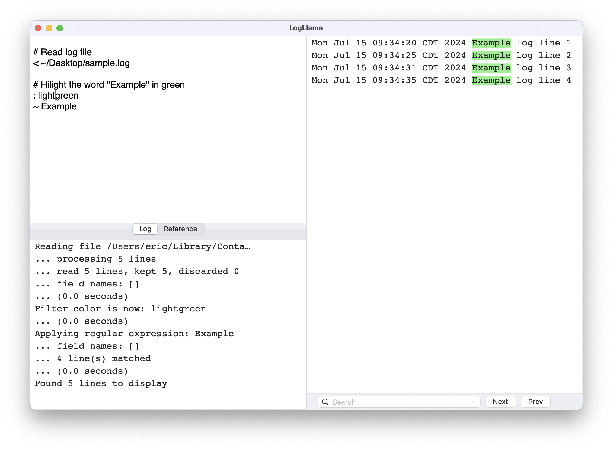
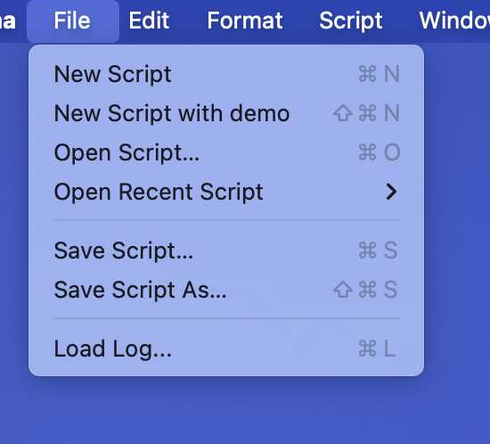

# Getting Started

## Working with scripts

In LogLlama, you load and work with log data using scripts.  Here's an example:

```
# Read log file
< ~/Desktop/sample.log

# Hilight the word "Example" in green
: lightgreen
~ Example
```

You can type scripts into the script panel in the top left of the LlogLlama window like this:



You can load and save scripts as text files using the following menu commands:

- `File ... New Script`
- `File ... New Script with demo`
- `File ... Open Script`
- `File ... Recent Scripts`




## Loading Log Data

You can load a log file using the menu command `File ... Load log...`.  This will launch a file selection dialog.  
You can use multiple selection to load more than one file at a time, so long as they are in the same folder.

You can also load one or more log files using the script command `<`, for example:

```
< ~/Desktop/sample.log
< ~/logs/service.log.*
```

Because LogLlama is a sandboxed application, your script can only load files from disk this way if you have previously 
granted access to the files using the file selection dialog.  During any run, the first time you try to load a file using
script command, LogLlama will detect that it can't yet access the file and will show the file selection dialog with your
specified file already selected;  just confirm the selection and your file will be read.


## Demo Log Data

Many of the examples in this documentation use randomly generated log data.  You can generate random log lines using the `demo` command:

```
# Generate random sample data
demo
```


