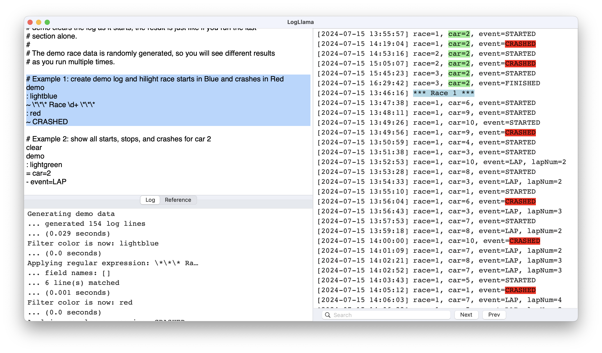

### Filtering and Hilighting Log Lines


## Basic Filtering and hilighting

Filtering and hilighting log lines is LogLlama's bread and butter.  These are the script commands you use:

| Command      | Description |
| ------------ | ----------- |
| `: (color)` | Set the color to be used for following hilight commands.  For the list of supported colors, see [the source code for the `ColorCommand`](https://github.com/lostbearlabs/LogLlama/blob/main/Script/ColorCommand.swift). |
| `~ (regex)` | Hilight matches. |
| `= (regex)` | Hilight matches, and hide any lines with no matches. |
| `+ (regex)` | Hilight matches, and unhide any lines with matches. |
| `- (regex)` | Hide any lines with matches |
| `==` | Hide any lines with no hilights in them. |
| `chop` | Remove any hidden lines.  Unhide will no longer be able to show them.  Operations will run faster on the smaller set of lines | 
| `clear` | Remove ALL lines. |
| `today` | Hide any lines that don't contain today's date.  See below. |


## Filtering at load time

If your log file is very large, you might not want to load the whole thing into memory.  The following script
commands are applied at load time.  Any lines that are excluded by these filters are never loaded into memory and
can't be seen or unhidden.  You might use this if you want to examine the history of a particular GUID or IP address
within a very large log file.

| Command | Description |
| ------- | ----------- |
| `required (regex)` | Don't load lines unless they have a match. |
| `exclude (regex)` | Don't load lines if they do have a match. |
| `requireToday` | Don't load lines unless they contain today's date.  See below. |
| `limit (N)` | In any single file, don't load more than N lines. |
| `clearFilters` | Reset any load filters. |


## Modifying Lines

Once lines are loaded, they can be modified in memory.

| Command | Description |
| ------- | ----------- |
| `truncate (N)` | Truncate all lines to at most N characters. |
| `replace (regex) (replacement)` | Replaced any matches. |

If you are working with fields, you can also sort lines by field.  See [SQL Queries](./sql_queries.md) for more information.


## Example

Here are some scripts that demonstrate filtering and hilighting.  You can generate a list of scripts
like this to try out by running the menu command `File ... New with demo`

```
# Example: create demo log and hilight race starts in Blue and crashes in Red
demo
: lightblue
~ \*\*\* Race \d+ \*\*\*
: red
~ CRASHED

# Example: show all starts, stops, and crashes for car 2
clear
demo
: lightgreen
= car=2
- event=LAP
```

Here is what the output from the first example looks like:




## Filtering by Today's date

You can always filter lines by the current date with an explicit filter, for example `= 2019-08-17`.

To avoid modifying your script every day, use the commands `today` and `requireToday` instead.  These commands dynamically create a filter based on the current date.

By default, the format used is `MM.dd.YY`.  You can replace this with another format using the `dateFormat` command, for example `dateFormat YYYY-MM-dd`.

| Command | Description |
| ------- | ----------- |
| `today` | Hide any lines that don't contain today's date. |
| `requireToday` | Don't load lines unless they contain today's date. |
| `dateFormat (format)` | Specify the format to be used with `today` and `requireToday`. |
