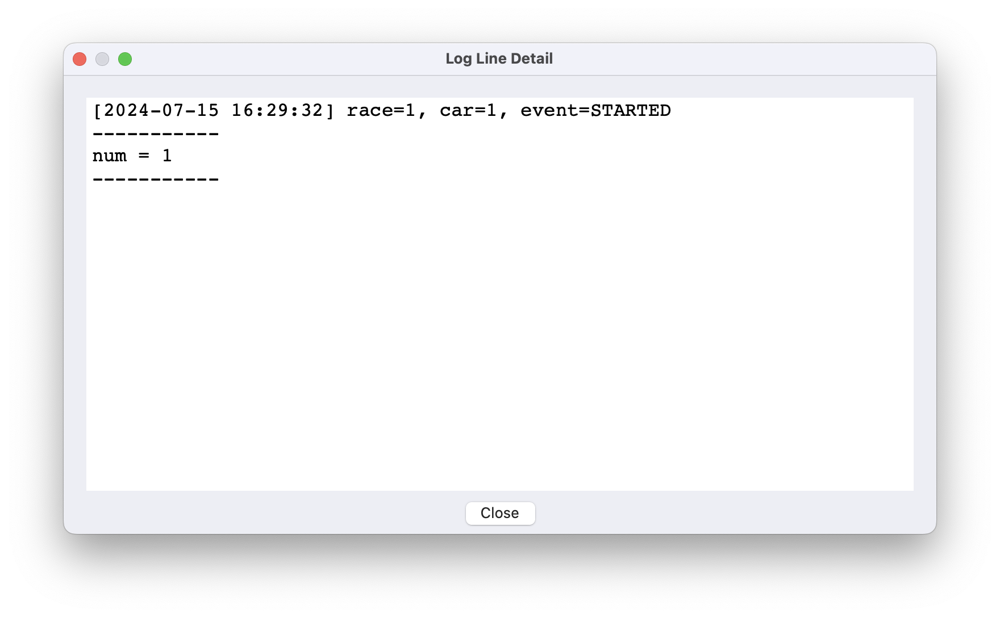
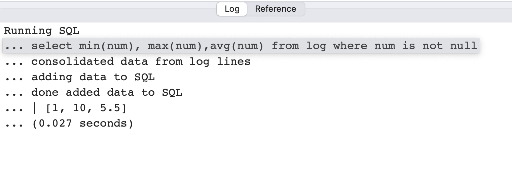

# SQL Queries

## Discovering fields

LogLlama can convert log lines with field/value pairs to a SQL table, allowing you to perform any legal SQLite query against the data.

Any log text matching the regular expression `(\w+)=(\w+)` is automatically treated as a field/value pair.  Field names discovered this way are listed in the output from the `<` command that reads the log file.

In addition, you can create your own field value pairs by using named groups in your pattern maching expressions.  Here is an example with the canned demo data:

```
clear
demo
~ car=(?<num>\d+), event=STARTED
```

If you double click on a log line with fields in it, the field values will be displayed.  This is a useful check that you are capturing the values you intend:



## SQL queries

Once field values have been identified for your log lines, you can use SQL queries to perform aggregation of those field values.

The SQL table that receives the data is named `log`.

An example SQL query for the demo data is:

```
sql select min(num), max(num),avg(num) from log where num is not null
```

When you run the SQL query, the output is listed in the script log on the bottom left.



## Backfilling fields

If one field is always derived from another, for example if the same `UserID` is always associated with a particular `ComputerID` then you can backfill the value of `UserID` into lines that don't have it by doing a lookup on `ComputerID`.  The syntax for this is

```
@ UserID ComputerID
```

This is useful when performing queries on logs with inconsistent formatting.


## Other uses for fields

The script command `/r (field)` creates a section header on any line where the value of the specified field has changed from 
previous lines.  This is useful for things like creating a section when the IP you are connected to changes.

The script command `sort (field1) (, field2, field3, ...)` sorts your log lines according to the specified fields.  Field values are treated as strings,
and lexicographic sort order (not numerical sort order) is used.  If all fields match, or no fields are specified, then the lines are just sorted by lexicographic comparison of their full text.