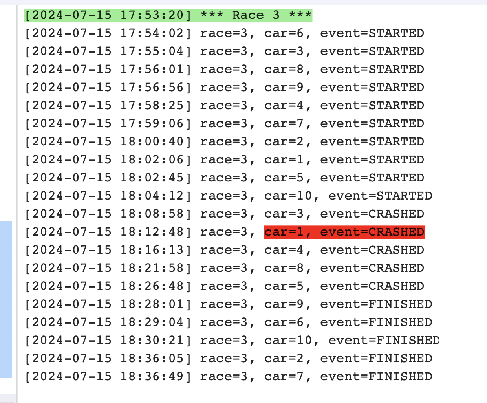

# Working With Sections

## Sections

Sometimes a log file can be divided into distinct sections.  For example, if your log includes a daily server
job then the start of the job might be considered a section marker.  In our demo data, each race can be
considered a section.

LogLlama gives you the ability to specify section headers and then selectively hide or show sections.
The commands for this are:

| Command | Description |
| ------- | ----------- |
| `/r (regex)` | Mark matching lines as section headers. |
| `/f (field)` | Mark lines where the field value changes as section headers. |
| `/= (regex)` | Hide any sections that don't have at least one matching line.
| `/- (regex)` | Hide any sections that do have at least one matching line. |


LogLama can divide log lines into sections and selectively hide sections.  For example:

```
# Example: just show races where car 1 crashes
clear
demo
- event=LAP
: lightgreen
/r \*\*\* Race \d+ \*\*\*
: red
~ car=1, event=CRASHED
/= car=1, event=CRASHED

```

The demo data has output for 3 races, but the number that are displayed will vary from run to run, 
depending on whether the random generator led Car #1 to crash in each race.  Here's an example output
in which only Race #3 contained the qualifying crash:


